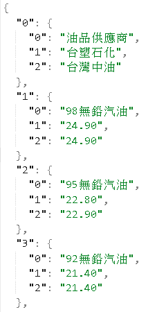
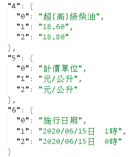
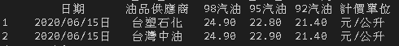

#### 安裝所需套件
`pip install -r requirements.txt`

#### 透過pandas套件來實作功能
- pd.read_html(): 快速獲取在html中頁面中table格式的數據
- Data.loc(): 用index的標籤來取出資料

#### 透過datetime套件來實作功能
- datetime.now(): 獲取當天的日期

#### 程式說明
使用Python語言開發，依照當天日期透過爬蟲程式來取得最新油價資訊: 日期、油品供應商、

98、95、92無鉛汽油價格 ，最後將結果呈現與存為.json檔。

#### 執行結果

